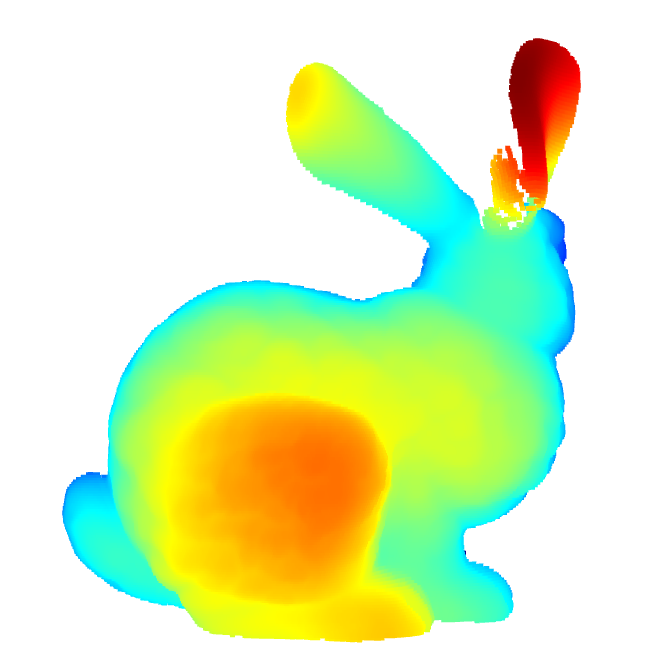
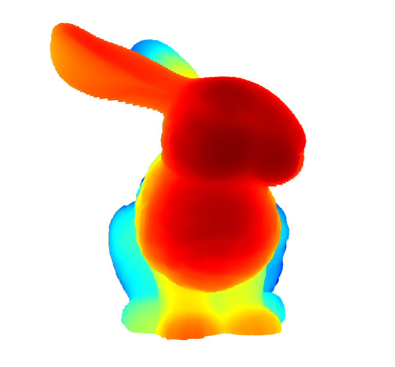

# CS172-Assignment-2

## 1. Basic Point Cloud Operation

  

    
<strong>p1_000</strong>

    
  

  

    
<strong>p1_090</strong>

    
  

  

    
<strong>p1_180</strong>

    
  

    

    
<strong>p1_270</strong>

    
  

## 2. Point Cloud Registration

### 2.1 ICP

  

    
<strong>000with045</strong>

    
  

  

    
<strong>000with315</strong>

    
  

  

    
<strong>270with315</strong>

    
  

### 2.2 ICP with RANSAC

  

    
<strong>000with045</strong>

    
  

  

    
<strong>000with315</strong>

    
  

  

    
<strong>270with315</strong>

    
  

